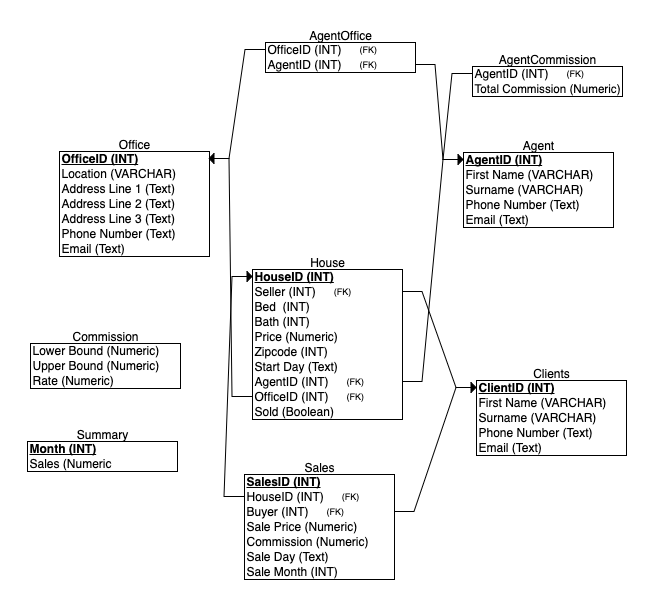

# Database_application
CS162 Database Application Assignment

## Running the SQL code:
To succuessfully run the files in this assignment, please follow the following instruction: <br/>
First, get to the sqlite3 console on the terminal (assuming you have sqlite3 set up):

```bash
$ sqlite3
```

First run ```create.sql``` to set up the tables:

```bash
>>> .read create.sql
```

Run ```insert.sql``` to insert data:

```bash
>>> .read insert.sql
```

Run ```query.sql``` to run all the query statements:

```bash
>>> .read query.sql
```
## Normalization, Transaction, and Indices
When we create tables, we follow normalization guidelines to both reduce redundancy and avoid dependencies. I mainly follow guidelines of 3NF and ensure that there are no transitive functional dependencies. When constructing a many-to-many relationship between tables, I create a new table that stores the particular relationship between the two tables (e.g. the AgentOffice Table). <br/>
The data insertion process includes transactions when a client buys a house. A transaction is needed because multiple tables need to be updated without interruption when this purchase takes place. We want to ensure that, when a connection is interrupted, either all of the transaction goes through (success) or nothing in the transaction goes through (To avoid a house being bought but the agent did not receive commission). <br />
We use indices to speed up query speed when we want to find transactions in a given month (question 4 and 5)

## ERD for the database:
